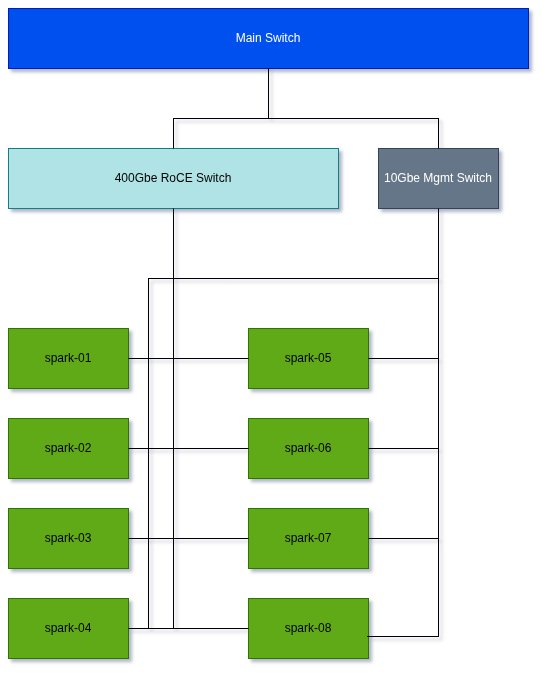

# Setting up 8 DGX Sparks for Large LLM Hosting



## Basic Cluster Pre-Requisites

- To make things easier each DGX Spark has to already have the same username and password.
- Configure passwordless `sudo`.
- Make sure all DGX Sparks can "discover" each other through SSH. 
  - You can use the `discover-sparks` script provided by NVIDIA, or just copy the SSH keys directly to every single node.
  - FYI - `discover-sparks` script isn't very robust and will detect other hosts on the network and attempt to copy keys over.
- Update every single DGX Spark:

```bash
sudo apt update
sudo apt dist-upgrade
sudo fwupdmgr refresh
sudo fwupdmgr upgrade
sudo reboot
```

Every _single_ one of them have to be at the same state. Or else, trouble.

## Switch

You will need a switch with at least **2** 400Gbe ports. What we have to do is split each port into 4, 100Gbe links. Yeah, yeah I know the DGX Spark is 200Gbe, but if you're serving such big models with a large number of active params, you're most likely going to be compute/memory bound anyway -- so the Sparks are less likely to saturate the network during all-reduce anyway with TP. How do I know? All subjective/empirical. You can back out now if you want.

I use a 400Gbe -> 4x100Gbe breakout cable from FS.com.

It's these: https://www.fs.com/products/141930.html 

> 2.5m (8ft) NVIDIA/Mellanox MCP7F60-W02AR26 Compatible 400G QSFP-DD 8 x 50G PAM4 to 4 x 100G QSFP56 2 x 50G PAM4 Ethernet Passive Copper Breakout Cable 

Heads up, since I have a Mikrotik switch, it is not picky about the cable.

If you have another type of switch that may be picky, I would not use NVIDIA branded one.

Try something more generic: https://www.fs.com/products/139219.html?attribute=33369&id=3712050

> 2.5m (8ft) Generic Compatible 400G QSFP-DD 8 x 50G PAM4 to 4 x 100G QSFP56 2 x 50G PAM4 Passive Copper Breakout Cable 

Probably cheaper too.

Next, you'll need to configure the odd number switch ports in your switch (Mikrotik) for `100G baseCR2`.

1. Turn off Auto-negotiation in switch settings.
2. Configure speed for `100G baseCR2`.

Set MTU for each QFSP56-DD switch port to 9000. Need L2MTU to be 9216 first.

```bash
[admin@MikroTik] > /interface ethernet set [find] l2mtu=9216               
[admin@MikroTik] > /interface ethernet set [find name~"qsfp56-dd"] mtu=9000
```

For RouterOS Mikrotik switch, the overall L2 MTU will adapt as appropriate.

Just check all your settings in switch at this point. Everything should be 9000+ and receiving traffic.

Larger MTU = better performance that's why.

## Enforce static IP on the NCCL side

I know the DGX Spark cluster setup guide from NVIDIA says you can just setup the IPs dynamically. I don't think this is a good idea, and can lead to headaches when operating more than 2. 

My recommendation is to configure static IPs for all of your Sparks. For me I just choose `192.168.100.11` to `192.168.100.18`. Note that you can choose any subnet you wish, `192.168.100.0/24` is just convenient for me as it is different enough from my typical network one of `192.168.1.0/24`.

For every DGX Spark node, apply the addresses `192.168.100.11` ... `192.168.100.18`.

**Important**: Note the MTU is 9000.

```bash
sudo tee /etc/netplan/40-cx7.yaml > /dev/null <<EOF
network:
  version: 2
  ethernets:
    enp1s0f0np0:                        # the CLEAN fabric interface
      addresses:
        - 192.168.100.11/24             # fabric IP (change per node: .11-.18)
      dhcp4: no
      mtu: 9000                         # jumbo frames, matches switch
    enP2p1s0f0np0:                      # the TWIN interface (the troublemaker)
      dhcp4: no
      dhcp6: no
      link-local: []                    # <-- THE FIX: no link-local GID
      optional: true                    # <-- don't block boot waiting on it
EOF
sudo chmod 600 /etc/netplan/40-cx7.yaml
sudo netplan apply
```

I'd reboot all of the nodes when you are done.

## NCCL

I don't claim to be an NCCL expert. Not even close, but I can tell you it's good to at least know the basics.

Here are some notes:

- The DGX Sparks are connected through RoCE, allowing RDMA.
- You must connect each DGX Spark individually to also a 10Gbe link. Think of those as the management ports. You connect to each Spark wih SSH through these links, not the ones connected through using QSFP ports.
- You ideally want to only have NCCL traffic through the RoCE fabric - otherwise other traffic will get in the way and degrade the performance.
- You really need to know the interface names... For me it was `rocep1s0f0` and `en1s0f0np0`
- `ib-if` is the interface name associated with RoCE
  - Data passed through here
- `eth-if` is the name of the interface for everything else not using RoCE. 
  - TCP traffic goes through here and used to establish the initial NCCL connection

## GLM 5.2

1. Download weights and copy them over to each node using: `download-model.sh`.
2. Rebuild container and copy the image over: `rebuild-and-copy.sh`

Copy these over to `spark-vllm-docker`:

- `mods` - contains the bug fixes for vLLM
- `recipes` - the `yaml` files necessary to launch the Docker container with GLM-5.2-NVFP4 weights.

Use: `launch-glm-5.2-nvfp4.sh` configured to point to wherever your `spark-vllm-docker` container is.

## Shutdown Cluster

Use: `shutodwn-cluster.sh`